# Agentic E-Commerce Platform — Byteshop

A modern, AI-powered e-commerce platform built on **Medusa v2** and **Next.js 15**, branded as **Byteshop**. Features a fully custom storefront UI, product review system, virtual try-on studio, order tracking, and a customised Medusa admin dashboard — with an agentic layer in progress for intelligent product discovery and conversational shopping.

---

## Storefront

### Store / Landing Page
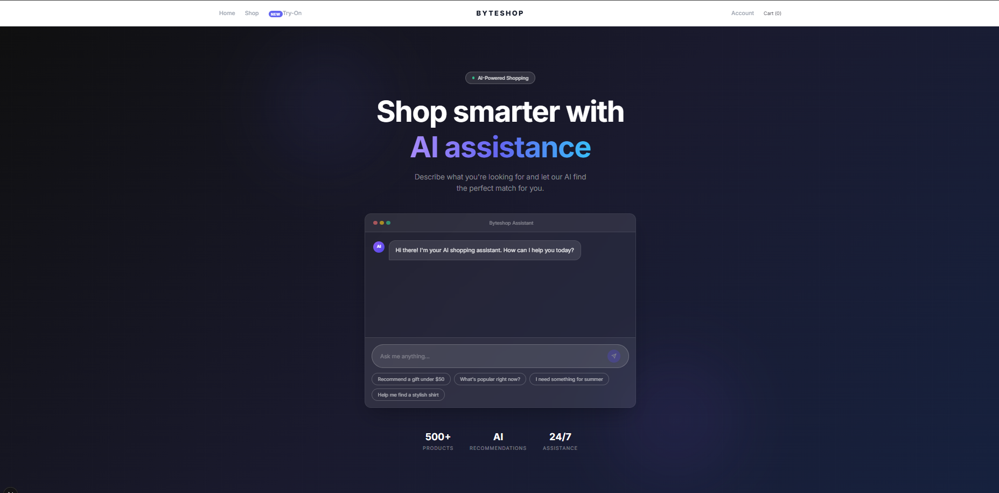

### Shop
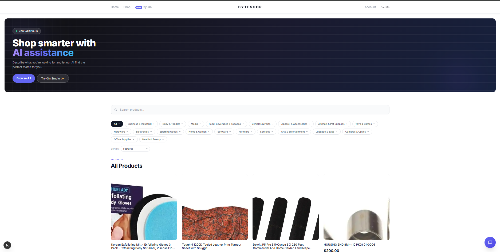

### Product Detail
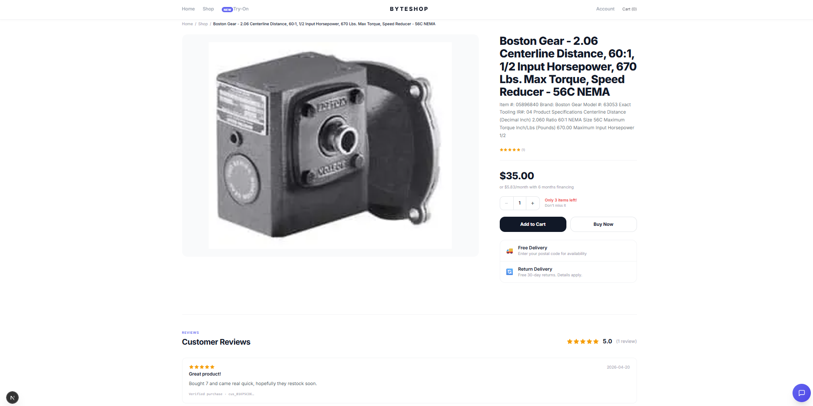

### Checkout
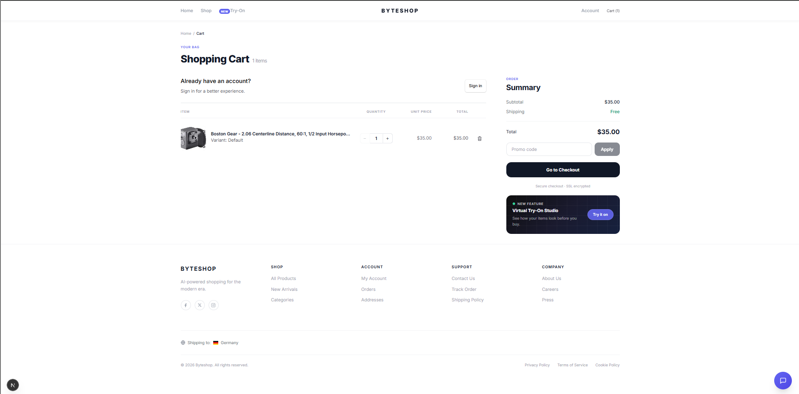

### Order Tracking
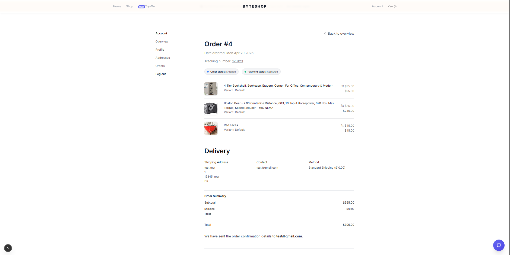

### Virtual Try-On Studio
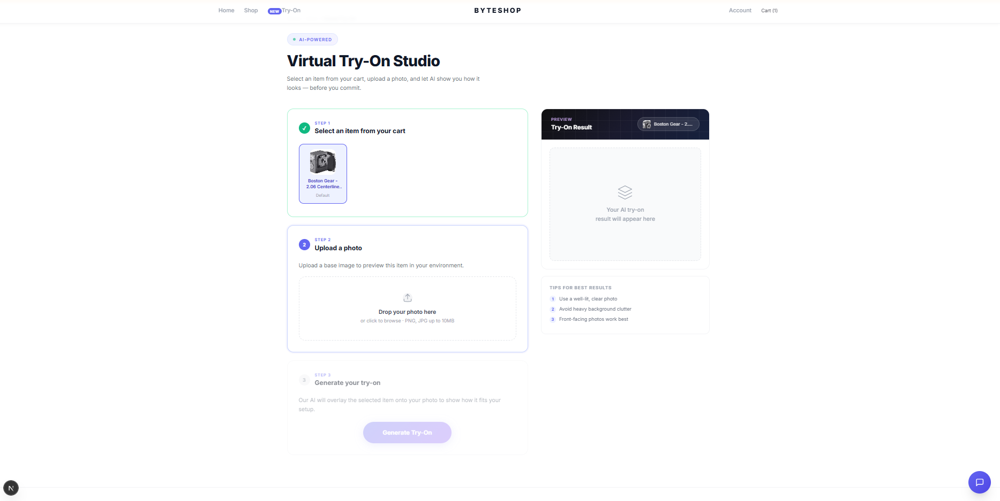

---

## Admin Dashboard

### Overview
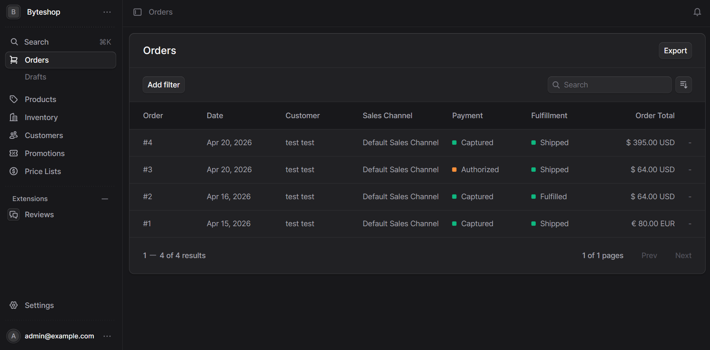

### Product Management
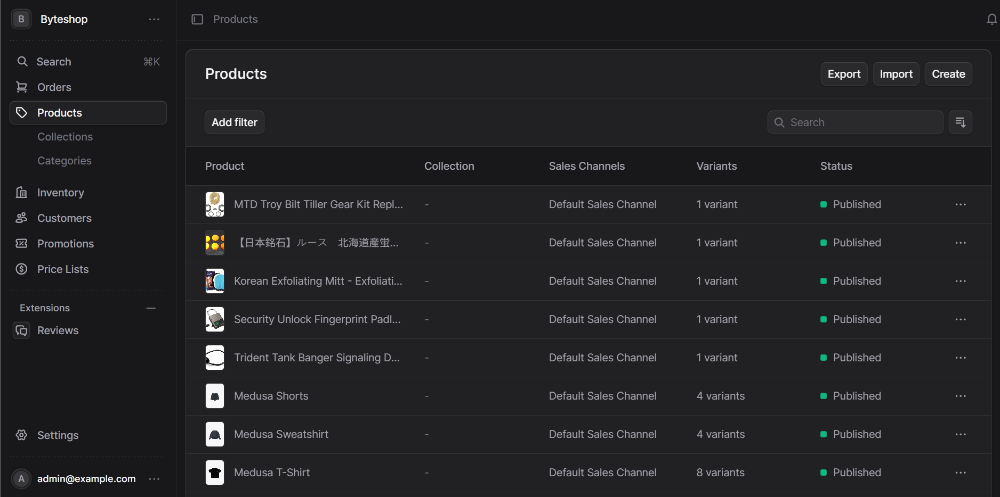

### Inventory & Fulfillment Tracking
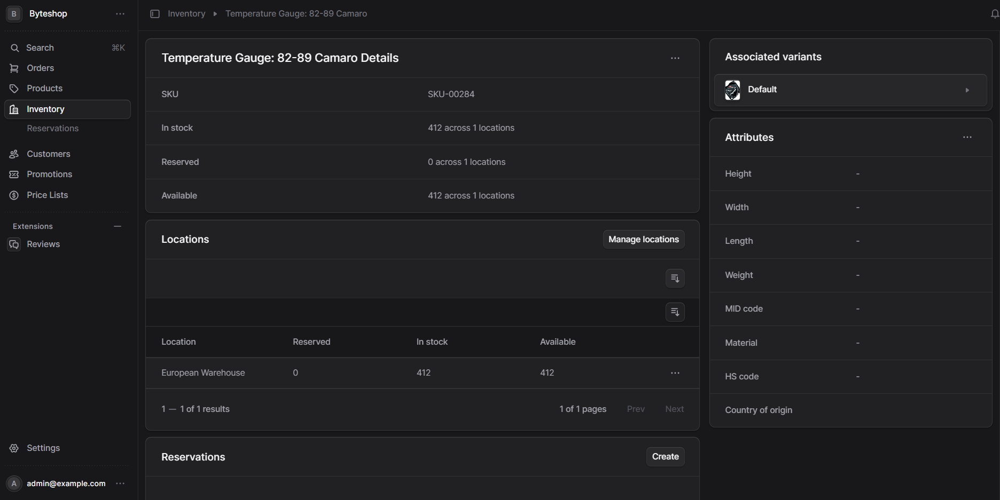

### Promotion Creation
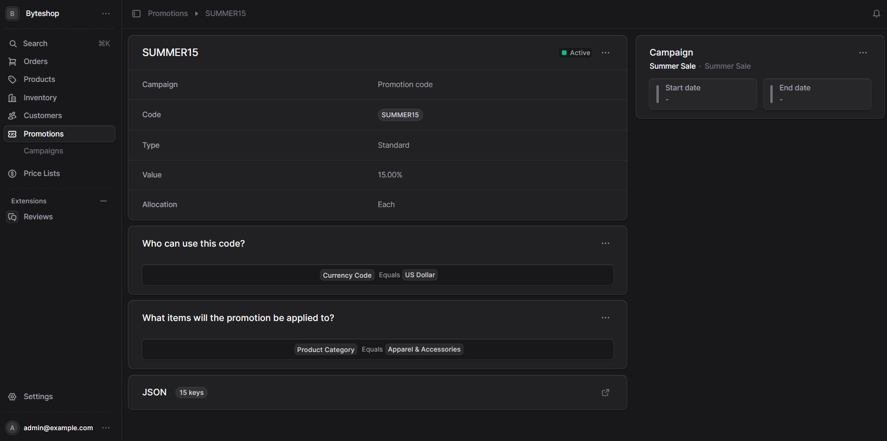

### Review Management
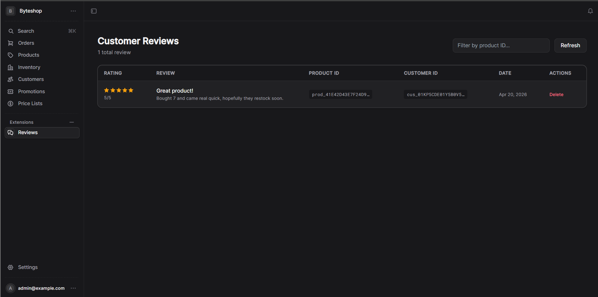

---

## Features

### Storefront
- Custom Byteshop theme — Inter font, indigo accent, dark hero banner
- Product grid with chip filter bar, sort dropdown, and paginated browsing
- Product detail page: image gallery, star rating, variant selector, quantity stepper, low-stock warning, Add to Cart + Buy Now
- Cart page: full redesign with item stepper, line totals, promo code input with validation warnings
- Checkout with discount code support and ineligible promotion detection
- Order details: status badges, payment status, fulfillment tracking number with clickable link

### Account & Orders
- Customer login, registration, profile management, address book
- Order history with per-order detail view
- Tracking number displayed on order detail page (pulled from fulfillment labels)
- Custom password change endpoint (fixes Medusa's broken built-in route)

### Review System
- Customers can leave star ratings + written reviews on purchased products
- Eligibility check: must have a completed order containing the product
- Duplicate prevention per customer per product per order
- Average rating displayed on product cards and detail pages

### Virtual Try-On Studio (`/try-on`)
- 3-step flow: Select item from cart → Upload photo → Generate try-on
- Before/after draggable comparison slider
- Scan overlay animation
- Wired to `/agent/tryon` endpoint (mock fallback included)

### Admin Dashboard Customisations
- **Review management** — dedicated admin page to browse, filter by product, and delete customer reviews with star display
- **Inventory widget** — auto-reloads after stock updates via MutationObserver on success toast
- **Fulfillment tracking** — add tracking numbers and shipping labels directly from the order page; visible to customers immediately
- **Promotion creation** — create discount codes with eligibility rules; storefront warns customers when a code applies but no cart items qualify

### More Features Not Pictured
- **Promo code warnings** — banner when a discount code is applied but no eligible items are in the cart
- **"NEW" Try-On badge** in the nav
- **Related products** ("Curated For You") section on each product page
- **Breadcrumbs** across store, product, and cart pages
- **Secure checkout note** + SSL indicator in cart summary
- **Try-On dark banner** in cart sidebar
- **Free delivery + returns perks panel** on product pages
- **Star rating on product preview cards** with "No reviews yet" fallback
- **500+ products** pre-seeded with images, inventory, and shipping profiles

---

## Tech Stack

| Layer | Technology |
|-------|-----------|
| Backend | Medusa v2 (Node.js) |
| Storefront | Next.js 15, React 19, Tailwind CSS |
| Database | PostgreSQL 17 |
| Cache / Pub-Sub | Redis |
| UI Components | Medusa UI, Radix UI |
| Auth | Medusa JWT (httpOnly cookie) |
| Agent Service | Express.js (in progress) |

---

## Directory Structure

```
.
├── agentic-store/              # Medusa v2 backend
│   ├── src/modules/review/     # Custom review module
│   ├── src/workflows/          # Create-review workflow
│   └── src/api/                # Store + admin API routes
├── agentic-store-storefront/   # Next.js storefront
│   └── src/modules/            # Cart, checkout, orders, products, try-on
├── agent-service/              # Express agent service (in progress)
├── docs/                       # Specs, design docs, screenshots
├── database_dump.sql           # Ready-to-restore DB (500+ products)
├── SETUP.md                    # Installation guide
└── HANDOVER.md                 # Full project history and session notes
```

---

## Getting Started

See **[SETUP.md](SETUP.md)** for full installation instructions including:
- PostgreSQL + Redis setup
- Restoring from `database_dump.sql`
- Environment variable configuration
- MCP server setup for AI assistants

```bash
# Terminal 1 — Redis
cd Redis && ./redis-server.exe ./redis.windows.conf

# Terminal 2 — Backend
cd agentic-store && pnpm dev

# Terminal 3 — Storefront
cd agentic-store-storefront && pnpm dev
```

| Service | URL |
|---------|-----|
| Storefront | http://localhost:8000 |
| Backend API | http://localhost:9001 |
| Admin Dashboard | http://localhost:9001/app |
| Agent Service | http://localhost:3001 |

---

## AI / MCP Note

This repository uses the **Medusa MCP Server** for real-time documentation access. AI assistants working on this project should connect to `@medusajs/mcp-server` — do not paste static Medusa docs into the repo. See `SETUP.md` for configuration.
